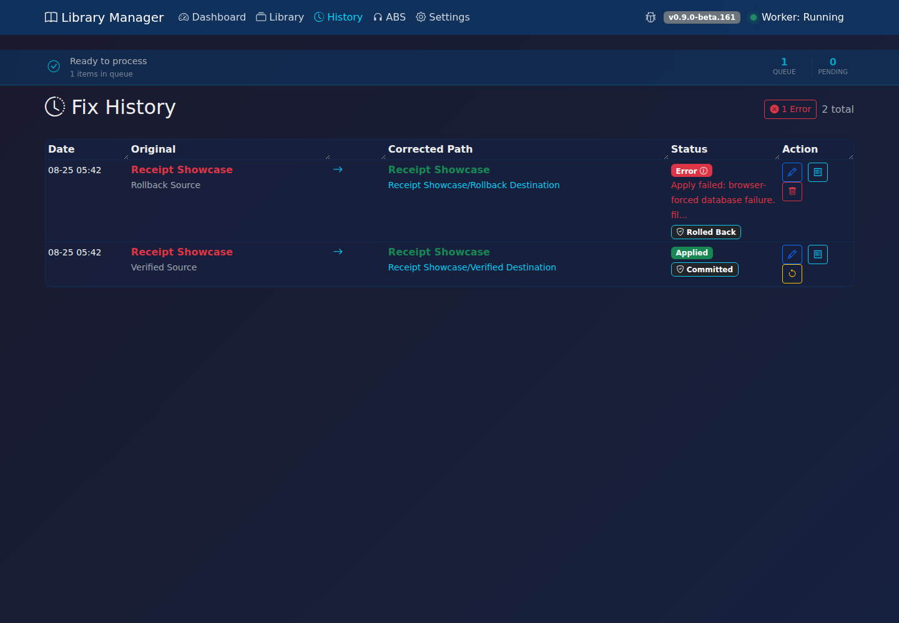
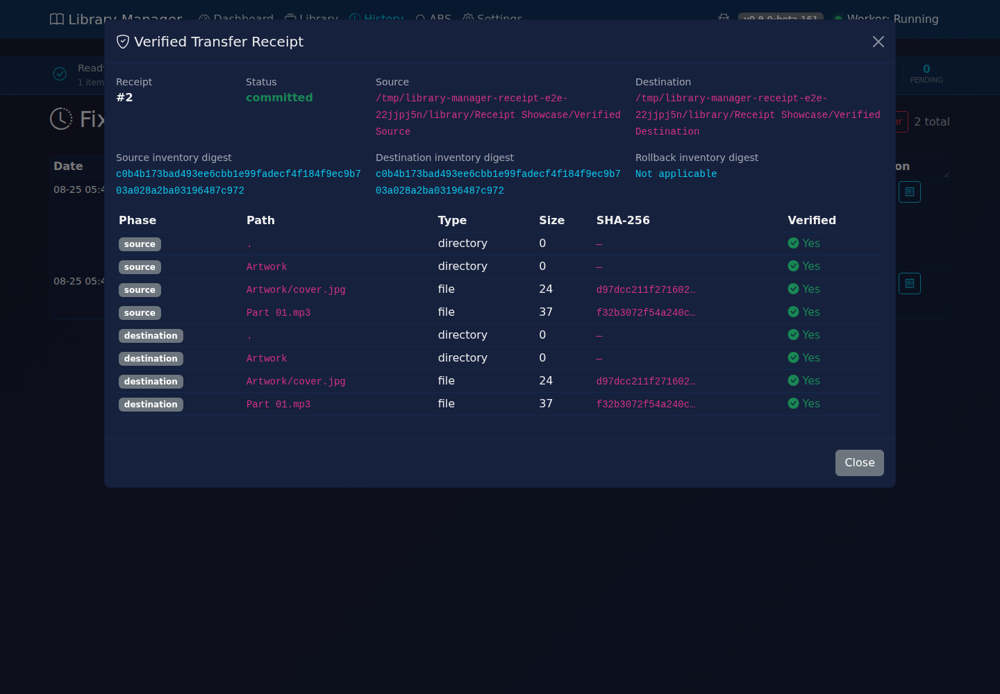
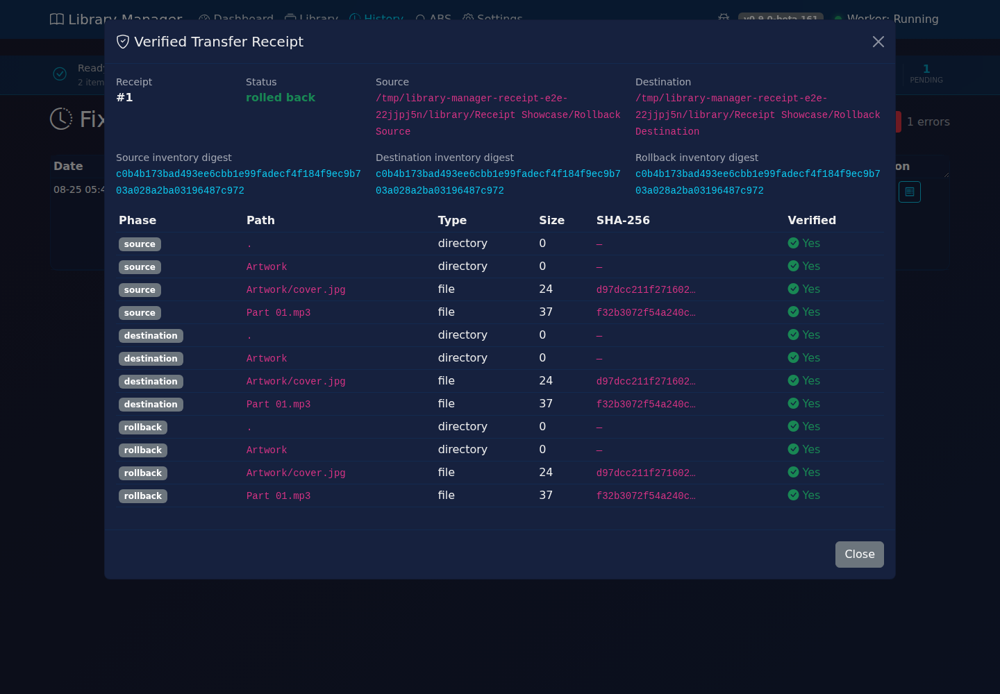
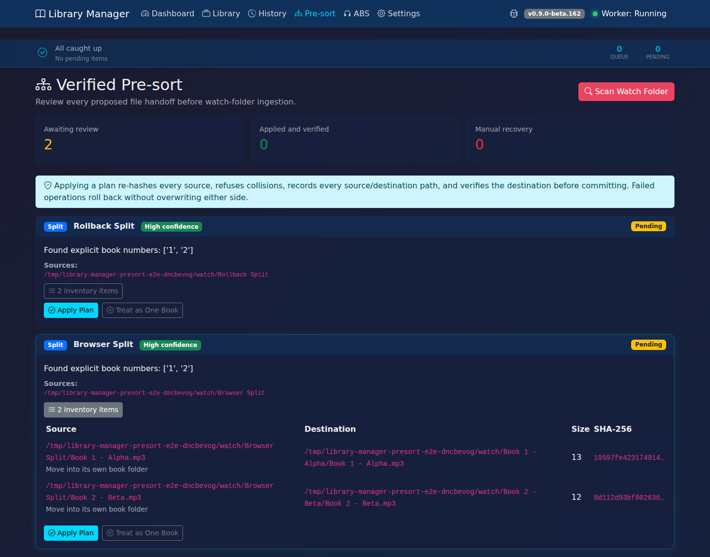
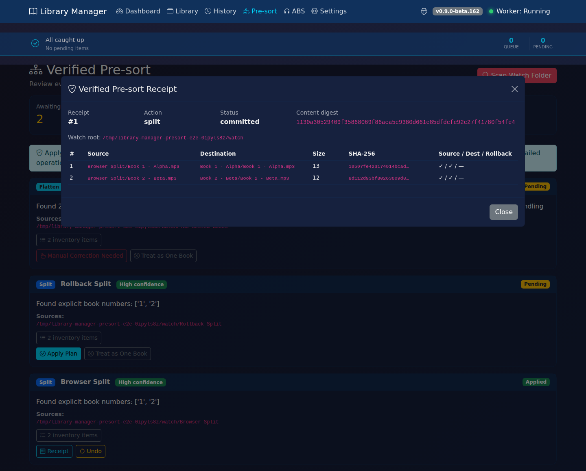
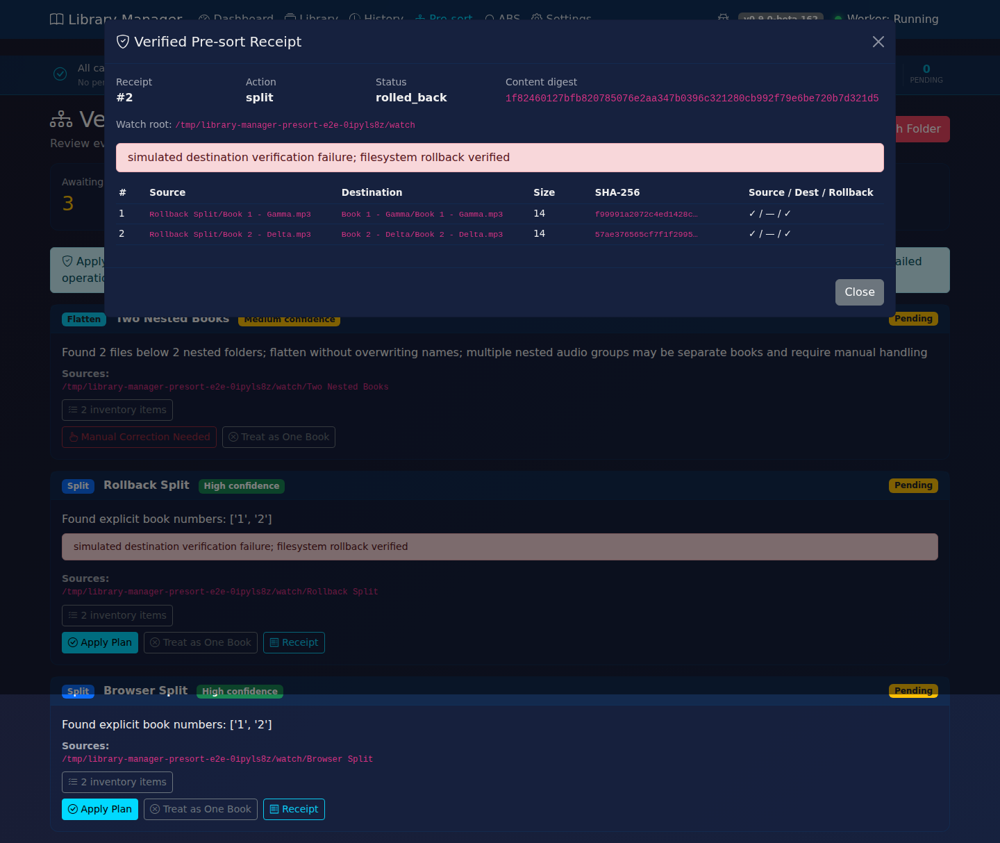
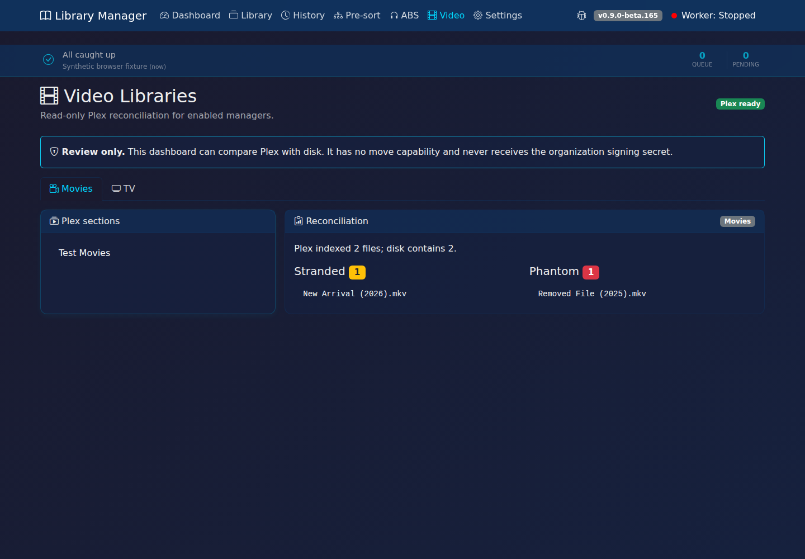
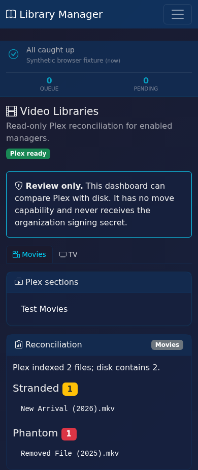

# Library Manager

<div align="center">

**Smart Audiobook Library Organizer with Multi-Source Metadata & AI Verification**

[](CHANGELOG.md)
[](https://ghcr.io/deucebucket/library-manager)
[](LICENSE)

*Automatically fix messy audiobook folders using real book databases + AI intelligence*

</div>

---

## Recent Changes (develop / beta)

> **beta.170** - **Private video receipts before first write**
> - Creates or tightens the loopback video organizer's receipt database as mode 0600
>   before SQLite initializes the ledger or accepts a request.
> - Refuses symlinks, non-regular files, and hard-linked receipt paths at startup so a
>   local path substitution cannot redirect operation evidence.

> **beta.169** - **Jellyfin 10.11 exact video verification**
> - Replaces Jellyfin's removed provider-ID query with a bounded scan of only the
>   configured destination library.
> - Requires exactly one matching TMDb/IMDb identity and fails closed on duplicate,
>   malformed, inconsistent, truncated, unavailable, or over-10,000-item results.
> - Keeps the video-move receipt free of titles, paths, URLs, credentials, and household
>   identity; no mutation contract changed.

> **beta.168** - **Safe no-signup Skaldleita access**
> - Uses the bundled, per-IP-limited shared key when no personal Skaldleita key is configured.
> - Signs every protected metadata, ISBN, fingerprint, narrator, voice, contribution, and audio-ID request with the full Library Manager version.
> - Treats `401`/`403` as terminal for protected workflows until restart or explicit personal-key replacement/removal, and never downgrades a rejected personal key to the shared key; Settings validation can still report a rejection and `429` remains temporary.
> - Skaldleita applies client blocks, minimum-version policy, and signature checks before either shared or personal key authorization.

> **beta.161** - **#300: Verified apply-fix transfer receipts**
> - Builds a complete pre-move inventory with file sizes, entry types, and SHA-256 hashes.
> - Verifies the destination inventory before committing the database path/history/queue update.
> - Records source, destination, and rollback handoffs in SQLite and exposes them from History.
> - Recovers interrupted applies on startup when rollback can be verified; otherwise marks the operation for manual recovery.
> - This is beta behavior and is not a substitute for filesystem or hardware backups.

> **beta.160** - **Naming template and performance updates**
> - Added `{asin}`, `{ripper}`, `{author_fl}`, and `{series_num.pad(N)}` support alongside existing author, title, series, language, narrator, year, edition, and variant fields.
> - Added standalone-book templates and opt-in ripper/release-tag preservation.
> - Added database indexes and orphan-scan caching for common dashboard/library paths.

> **beta.159** - **Fix: Watch-Folder 'database is locked' Contention** (Issue #215)
> - Watch-folder dedup writes now ride the worker's own DB connection instead of opening a second writer per call, ending the 30-second lock stalls while a library scan is running.
> - Watch worker exception paths now roll back, so a failed insert no longer leaves an open transaction stalling every later item.

> **beta.158** - **Fix: Summary Books No Longer Matched as Real Titles** (Issue #291)
> - Third-party summary/derivative editions (IRB Media, Start Publishing Notes, Instaread, etc.) are now filtered out of every candidate-acceptance path, so "Summary of Atomic Habits" can't win over the actual book.
> - Users who genuinely own a summary audiobook are exempt — if the filename says "summary", the match is allowed.
> - AI verification prompts now explicitly disallow summary/derivative books.

> Earlier release details are kept in the changelog so this page stays focused on current behavior.

[Full Changelog](CHANGELOG.md)

---

## The Problem

Audiobook libraries get messy. Downloads leave you with:

```
Your Library (Before):
├── Shards of Earth/Adrian Tchaikovsky/        # Author/Title swapped!
├── Boyett/The Hollow Man/                     # Missing first name
├── Metro 2033/Dmitry Glukhovsky/              # Reversed structure
├── [bitsearch.to] Dean Koontz - Watchers/     # Junk in filename
├── The Great Gatsby Full Audiobook.m4b        # Loose file, no folder
└── Unknown/Mistborn Book 1/                   # No author at all
```

---

## The Solution

Library Manager combines real book databases with AI verification to fix your library:

```
Your Library (After):
├── Adrian Tchaikovsky/Shards of Earth/
├── Steven Boyett/The Hollow Man/
├── Dmitry Glukhovsky/Metro 2033/
├── Dean Koontz/Watchers/
├── F. Scott Fitzgerald/The Great Gatsby/
└── Brandon Sanderson/Mistborn/1 - The Final Empire/
```

---

## Features

### Smart Path Analysis
- Works backwards from audio files to understand folder structure
- Database-backed author/series detection across multiple metadata sources
- Fuzzy matching ("Dark Tower" finds "The Dark Tower")
- AI fallback for ambiguous cases
- **Safe fallback** - connection failures don't cause misclassification

### Configurable Identification Pipeline (Audio-First)
```
Audio identification → audio credits → Skaldleita requeue/verification
→ API metadata lookup → AI verification → folder/name fallback when needed
```

Audio and text provider chains are configurable. Metadata can come from BookDB/Skaldleita, Audnexus, OpenLibrary, Google Books, and Hardcover; AI providers include Gemini, OpenRouter, Ollama, and OpenAI-compatible servers. Exact results depend on enabled providers and library content.

### Safety First
- **Drastic changes require approval** - author swaps need manual review
- **Garbage match filtering** - rejects unrelated, placeholder, and derivative-summary matches
- **Undo any fix** - every completed move can be reverted when both paths pass safety checks
- **Transfer receipts** - beta.161 records and verifies source/destination/rollback inventories with SHA-256 file hashes
- **Structure reversal detection** - catches Metro 2033/Author patterns
- **System folders ignored** - skips `metadata`, `cache`, `@eaDir`, etc.

Receipt examples from the current UI:





### Verified Watch-Folder Pre-sort (Beta)

Before the normal watch-folder pipeline runs, the opt-in pre-sort stage can split an explicit multi-book bundle, merge `CD1`/`CD2` or `Part 1`/`Part 2` sibling folders into one folder, and flatten redundant nested folders. It never silently assigns shared files or follows symlinks. Ambiguous plans wait for review unless Skaldleita fingerprints assign every audio file across at least two books; files sharing the same identity stay together.

Each plan is a literal handoff inventory: exact source and destination paths, byte sizes, SHA-256 hashes, aggregate digest, and verification state. Apply re-hashes every source, refuses collisions, writes the receipt before the first move, verifies every destination, and performs a verified rollback on failure. Undo is available while the outputs remain unchanged and have not moved into downstream ingestion; a successful Undo returns the restored bundle to Pending review instead of releasing it to the watcher.





### Video Reconciliation (Beta)

Movies and TV can be enabled independently. The read-only Video dashboard compares an
existing Plex SQLite catalogue with disk and reports stranded files (on disk but not
indexed) and phantom files (indexed but absent). Browser results use section-relative
paths; this dashboard has no move capability and never receives the separate organization
service's signing secret. The loopback organization service exposes only canonical signed
apply and read-only verification requests. Verification binds the exact digest-only
committed receipt, then freshly re-reads the Radarr destination and Jellyfin provider
identity; it cannot move files or inspect a different plan under an existing operation.

Synthetic fixture shown at desktop and mobile widths:




### Series Grouping (Audiobookshelf-Compatible)
```
Brandon Sanderson/Mistborn/1 - The Final Empire/
Brandon Sanderson/Mistborn/2 - The Well of Ascension/
James S.A. Corey/The Expanse/1 - Leviathan Wakes/
```

### Custom Naming Templates
Build your own folder structure:
```
{author}/{title}                          → Brandon Sanderson/The Final Empire/
{author}/{series}/{series_num} - {title}  → Brandon Sanderson/Mistborn/1 - The Final Empire/
{author} - {title} ({narrator})           → Brandon Sanderson - The Final Empire (Kramer)/
{author}/{language}/{title}               → Dmitry Glukhovsky/Russian/Metro 2033/
{author}/{title} [{lang_code}]            → Antoine de Saint-Exupéry/Le Petit Prince [fr]/
{author_fl}/{title} [{asin}]               → Brandon Sanderson/The Final Empire [B002V0QCYU]/
{author}/{series_num.pad(2)} - {title}     → Brandon Sanderson/01 - The Final Empire/
{title}-{ripper}                           → The Final Empire-H2OKing/
```

Available custom fields include `{author}`, `{author_first}`, `{author_last}`, `{author_lf}`, `{author_fl}`, `{title}`, `{series}`, `{series_num}`, `{series_num.pad(N)}`, `{narrator}`, `{year}`, `{edition}`, `{variant}`, `{language}`, `{lang_code}`, `{lang_flag}`, `{asin}`, and `{ripper}`. Missing optional values are removed before the path is sanitized.

### Language Support
- **28 languages** - German, French, Spanish, Italian, Portuguese, Dutch, Swedish, Norwegian, Danish, Finnish, Polish, Russian, Japanese, Chinese, Korean, Arabic, Hebrew, Hindi, Turkish, Czech, Hungarian, Greek, Thai, Vietnamese, Ukrainian, Romanian, Indonesian
- **Multi-language naming** - intelligent folder naming based on detected book language:
  - **Native mode** - Russian books get Russian titles, English books get English titles
  - **Preferred mode** - all books named in your preferred language
  - **Tagged mode** - preferred language + language tag ("Metro 2033 (Russian)")
- **Flexible tagging** - four formats `(Polish)`, `[pl]`, `Polish`, `_pl` + subfolder option
- **Preserve original titles** - keeps "Der Bücherdrache" instead of translating to English
- **Regional Audible search** - queries audible.de, audible.fr, etc. for localized results
- **Audio language detection** - use Gemini to detect spoken language in audiobooks

### Additional Features
- **Web dashboard** with dark theme
- **Watch folder mode** - monitor downloads folder, auto-organize new audiobooks
- **Manual book matching** - search the configured metadata sources directly
- **Edit & lock metadata** - correct wrong matches, lock to prevent overwriting
- **Library search** - find any book by author or title
- **Loose file detection** - auto-creates folders for dumped files
- **Ebook management (Beta)** - organize ebooks alongside audiobooks with ISBN lookup
- **Health scan** - detect corrupt/incomplete audio files
- **Audio analysis (Beta)** - extract metadata from audiobook intros via Gemini
- **In-browser updates** - update from the web UI
- **Backup & restore** - protect your configuration
- **Version-aware renaming** - different narrators get separate folders

---

## Quick Start

### Option 1: Docker (Recommended)

```bash
# Pull from GitHub Container Registry
docker run -d \
  --name library-manager \
  -p 5757:5757 \
  -v /path/to/audiobooks:/audiobooks \
  -v library-manager-data:/data \
  ghcr.io/deucebucket/library-manager:latest
```

Or with Docker Compose:

```yaml
version: '3.8'
services:
  library-manager:
    image: ghcr.io/deucebucket/library-manager:latest
    container_name: library-manager
    ports:
      - "5757:5757"
    volumes:
      - /your/audiobooks:/audiobooks
      - library-manager-data:/data
    restart: unless-stopped

volumes:
  library-manager-data:
```

### Option 2: Direct Install

```bash
git clone https://github.com/deucebucket/library-manager.git
cd library-manager
python -m pip install -r requirements.txt
python app.py
```

### Configure

1. Open **http://localhost:5757**
2. Go to **Settings**
3. Add library path (`/audiobooks` for Docker, or your actual path)
4. Configure the selected provider. Hosted providers may require their own credentials; Ollama and OpenAI-compatible local servers can run without a hosted key.
5. **Save** and **Scan Library**

---

## Docker Installation

### Volume Mounts

Docker containers are isolated. Mount your audiobook folder:

```yaml
volumes:
  - /your/audiobooks:/audiobooks  # LEFT = host, RIGHT = container
  - library-manager-data:/data    # Persistent config/database
```

Use `/audiobooks` (container path) in Settings.

### Platform Examples

| Platform | Volume Mount |
|----------|-------------|
| **UnRaid** | `/mnt/user/media/audiobooks:/audiobooks` |
| **Synology** | `/volume1/media/audiobooks:/audiobooks` |
| **Linux** | `/home/user/audiobooks:/audiobooks` |
| **Windows** | `C:/Users/Name/Audiobooks:/audiobooks` |

See [docs/DOCKER.md](docs/DOCKER.md) for detailed setup guides.

See [docs/Release-and-PR-Workflow.md](docs/Release-and-PR-Workflow.md) for the required documentation, wiki, browser-verification, and screenshot update flow.

---

## Configuration

### Key Settings

| Option | Default | Description |
|--------|---------|-------------|
| `library_paths` | `[]` | Folders to scan |
| `naming_format` | `author/title` | Folder structure |
| `series_grouping` | `false` | Audiobookshelf-style series folders |
| `auto_fix` | `false` | Auto-apply vs manual approval |
| `protect_author_changes` | `true` | Require approval for author swaps |
| `scan_interval_hours` | `6` | Auto-scan frequency |

### AI Providers

**Google Gemini**
- Hosted provider quotas vary; check Google AI Studio for the current limits.
- Get key at [aistudio.google.com](https://aistudio.google.com)

**OpenRouter**
- Multiple model options
- Model availability and account terms vary; check OpenRouter's current catalog.

**Ollama**
- Self-hosted with live model discovery from the user's server
- No hardcoded model requirement

**llama.cpp / OpenAI-compatible**
- Works with llama.cpp, LM Studio, vLLM, LocalAI, and compatible `/v1` APIs
- Live model discovery and optional API-key authentication

---

## API Reference

| Endpoint | Method | Description |
|----------|--------|-------------|
| `/api/scan` | POST | Trigger library scan |
| `/api/deep_rescan` | POST | Re-verify all books |
| `/api/process` | POST | Process queue items |
| `/api/queue` | GET | Get queue |
| `/api/library` | GET | Get library with filters |
| `/api/stats` | GET | Dashboard stats |
| `/api/apply_fix/{id}` | POST | Apply pending fix |
| `/api/file-operation-receipt/{id}` | GET | Inspect a transfer receipt and inventory |
| `/api/reject_fix/{id}` | POST | Reject suggestion |
| `/api/undo/{id}` | POST | Revert applied fix |
| `/api/edit_book` | POST | Edit & lock book metadata |
| `/api/unlock_book/{id}` | POST | Unlock book for reprocessing |
| `/api/analyze_path` | POST | Test path analysis |

---

## Troubleshooting

**Wrong author detected?**
→ Go to Pending → Click Reject (✗)

**Want to undo a fix?**
→ Go to History → Click Undo (↩)

**Series not detected?**
→ Enable Series Grouping in Settings → Library

**Docker can't see files?**
→ Check volume mounts in docker-compose.yml

---

## Development

### Run Tests

```bash
# Full integration test suite (pulls from ghcr.io)
./test-env/run-integration-tests.sh

# Build from local source instead
./test-env/run-integration-tests.sh --local

# Rebuild 2GB test library first
./test-env/run-integration-tests.sh --rebuild

# Offline/no-network mode (disable API/AI layers)
./test-env/run-integration-tests.sh --offline --local --rebuild

# If your runtime is docker (not podman):
CONTAINER_RUNTIME=docker ./test-env/run-integration-tests.sh --offline --local
```

### Local Development

```bash
python app.py  # Runs on http://localhost:5757
```

---

## Testing

Run checks in proportion to the change:

```bash
ruff check .
python test-env/test-naming-issues.py
python test-env/test-apply-fix-atomicity.py
./test-env/run-integration-tests.sh --local --offline
docker build -t library-manager .
```

UI/workflow changes must also be exercised through the actual browser UI. The transfer-receipt browser test boots a disposable app, SQLite database, and fake audiobook library, drives the History Apply and receipt flows, forces a database failure, verifies the restored SHA-256 inventory, and refreshes the documentation screenshots:

```bash
python test-env/e2e-apply-fix-receipt.py
```

A local Playwright installation and Chromium browser are required for that script. See [docs/Release-and-PR-Workflow.md](docs/Release-and-PR-Workflow.md) and [CONTRIBUTING.md](CONTRIBUTING.md) for the complete verification and documentation checklist.

---

## Credits & Acknowledgments

This project wouldn't be what it is without the community. Special thanks to:

### @Merijeek
The idea for **Skaldleita** (audio fingerprinting + narrator voice identification) came from Merijeek's suggestion in Issue #72 about MAM hashing. His vision of "Shazam for audiobooks" became the foundation for Skaldleita - instant audiobook identification via voice fingerprints. Beyond that, his thorough testing on the `:develop` branch has caught countless edge cases and made Library Manager far more robust. His blunt feedback pushes the project to be better.

### Community Testers
- **Dennis** - Remote Pi testing, ARM/low-resource environment validation
- **WickedT53** - BookDB stability testing, Unraid platform support
- **greggh** - UI bug reports, Docker testing
- **freitagdavid** - Code quality feedback

### Open Source Projects
- **Chromaprint/fpcalc** - Audio fingerprinting technology
- **faster-whisper** - Speech-to-text transcription
- **WeSpeaker** - Voice embedding models for narrator identification

---

## Contributing

Pull requests welcome! Ideas:
- [x] Ollama and generic local LLM support
- [ ] Cover art fetching
- [x] Metadata embedding (added in v0.9.0-beta.20)
- [ ] Movie/music library support

---

## Support & Contact

- **Issues/Bugs:** [GitHub Issues](https://github.com/deucebucket/library-manager/issues)
- **Email:** hello@deucebucket.com

---

## License

MIT License - See [LICENSE](LICENSE) for details.

**What this means:**
- Free to use, modify, distribute, sublicense, and sell
- Private and commercial modifications are permitted
- The copyright and license notice must be retained
